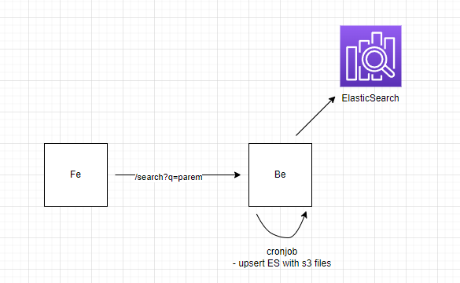

# search

# local dev

```
docker-compose -f docker-compose.local.yml build
docker-compose -f docker-compose.local.yml up
```

# Information

| Name | Detail            |
| ---- | ----------------- |
| URL  | http://3.1.48.27/ |

## Product Requirement Doc

# Objective

- scan and retrieve files with desired keywords

# User Scenario

- User searching for relevant files
  - User can search for keywords
  - User can view result
  - User can download files

# Features

- Frontend
  - Searchbar for users to input keywords
  - Display search results eg. [{"name":"name1", "link":"link1"},...]
  - User can download file containing the desired keywords
- Backend
  - Cronjob to upsert s3 files to ES
  - /search endpoint to return list of files containing desired keywords
  - S3 files are analysed using Apache Tika and text are formatted

# Design



# Considerations

- to improve the performance of the search, rather then updating the ES and quering the ES upon /serach request. Cronjob (1 min) is used instead to sync up ES and S3.
- S3 file contents are formatted using re.sub(r"(@\[A-Za-z0-9]+)|([^0-9A-Za-z \t])|(\w+:\/\/\S+)|^rt", " ", text) to remove any undesirable characters
- ES Upsert api is used with they key of the object being the name to minimize duplicates
