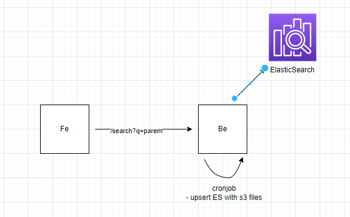

# search

# local dev

```
docker-compose -f docker-compose.local.yml build
docker-compose -f docker-compose.local.yml up
```

# Information

| Name | Detail            |
| ---- | ----------------- |
| URL  | http://3.1.48.27/ |

## Product Requirement Doc

# Objective

- scan and retrieve files with desired keywords

# Features

- Backend
  - Cronjob for updating s3 files to ES
  - /search endpoint to query for desired keywords
  - S3 files are analysed using Apache Tika and text are formatted
- Frontend
  - Searchbar for users to input keywords
  - Display search results eg. [{"name":"name1", "link":"link1"},...]

# Architecture



# Analytics

- to improve the performance of the search, rather then updating the ES and quering the ES. Cronjob (1 min) is used instead to minimize difference in ES and S3 states. (preferably s3 content can be upserted into ES upon update using lambda)
- S3 file contents are formatted using re.sub(r"(@\[A-Za-z0-9]+)|([^0-9A-Za-z \t])|(\w+:\/\/\S+)|^rt", " ", text) to remove any undesirable characters and make it easier for ES to do the searching
